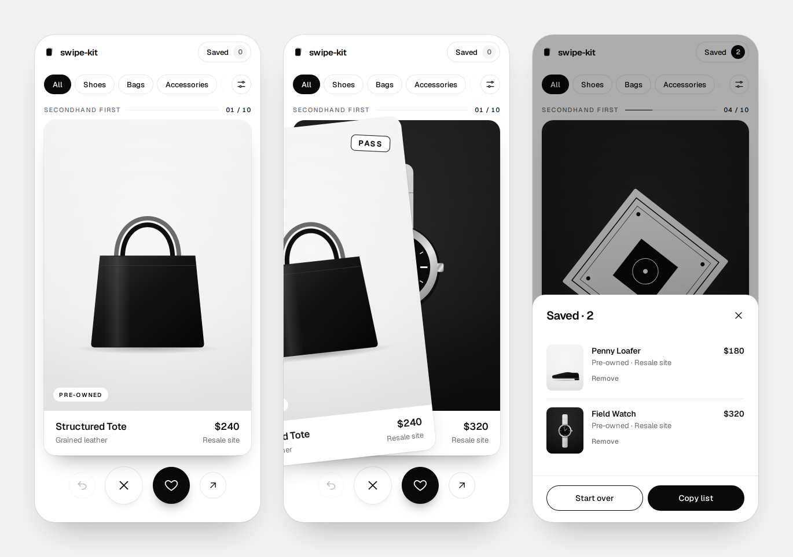

# swipe-kit

A minimal framework for swiping on anything. Swipe left to pass, right to save, up to open. Cards come from any source, can be filtered, and the deck learns from your swipes so similar cards move up.

The first deck is secondhand-first shopping. The framework itself doesn't know anything about products.



## Quick start

```bash
npm install
npm run dev
```

Open http://localhost:5173. Add `?deck=names` to the URL to see the same framework with a text-only deck.

| Input | Pass | Save | Open | Undo |
| --- | --- | --- | --- | --- |
| Touch / mouse | drag left | drag right | drag up | ⟲ button |
| Keyboard | `←` | `→` | `↑` | `Z` or `⌫` |

Progress is kept in `localStorage`, so a refresh doesn't lose your place. **Saved → Start over** resets it.

## Swap in your own images

The seed deck is two things in `public/seed/`:

```
public/seed/
  items.json      ← one entry per card
  images/         ← drop your photos here
```

1. Put your images in `public/seed/images/`. A 4:5 portrait crop (for example 1200 × 1500) works best. JPG, PNG, WebP or SVG.
2. Edit `public/seed/items.json`, pointing `image` at the file name:

```json
{
  "id": "loafer-01",
  "title": "Penny Loafer",
  "price": 180,
  "image": "loafer.jpg",
  "category": "Shoes",
  "condition": "Pre-owned",
  "source": "Resale site",
  "details": "EU 38 · Calf leather",
  "href": "https://example.com/listing/123",
  "tags": ["leather", "black", "classic"]
}
```

| Field | Notes |
| --- | --- |
| `id` | Unique and stable. Saved progress is keyed on it. |
| `brand` | Optional. Shown above the title. |
| `price` | Optional. Hidden when missing; cents are shown when present. |
| `image` | A file name in `images/`, or a full `https://…` URL. Optional: without one, or if a link breaks, the card shows the brand name instead. |
| `category`, `condition` | Become the filters. `condition` is `Pre-owned`, `Vintage` or `New`. |
| `source` | Where the item comes from, shown on the card. |
| `href` | Where **Open** (swipe up) and **View** go. Use `#` for no link. |
| `tags` | Free-form. Used to learn what you like, never shown. |

Save the file and the dev server reloads. You don't need to touch any code.

The first five cards are real resale listings (thredUP and The RealReal). The rest use monochrome placeholder images; replace or delete them.

## Make a deck for anything

A deck is one config object: where the cards come from, what each swipe means, and what a card looks like. This is the complete `names` deck:

```tsx
import { arraySource, type DeckConfig, type SwipeItem } from '../../swipe'

interface Name extends SwipeItem {
  word: string
}

export const namesDeck: DeckConfig<Name> = {
  id: 'names',
  name: 'Name ideas',
  source: arraySource([{ id: 'atlas', word: 'Atlas' }, { id: 'loop', word: 'Loop' }]),
  actions: {
    left: { label: 'Nope', sentiment: 'negative' },
    right: { label: 'Keep', sentiment: 'positive' },
  },
  renderCard: (n) => <h2>{n.word}</h2>,
  summarize: (n) => ({ title: n.word }),
}
```

Register it in `src/App.tsx` and open `?deck=<id>`.

What you can configure:

- **`source`**: `arraySource(items)`, `jsonSource(url, map)`, `mergeSources(a, b, …)`, or any `{ load(): Promise<T[]> }`, such as a fetch to your API or a scraper.
- **`actions`**: `left` and `right` are required; `up` is optional. Each has a `label`, a `sentiment` (positive swipes go to Saved), an optional `weight` for learning, an `icon`, and an `onSwipe` side effect.
- **`facets`**: filter groups read from `item.facets`. The first one shows as chips and the rest go under **Refine**.
- **`learn`**: re-rank upcoming cards toward what gets saved (on by default).
- **`boost`**: a constant nudge per item. The product deck uses it to favor secondhand.
- **`renderCard`**: any React. Gestures, stamps and stacking are handled for you.
- **`summarize`**: title, subtitle, image, link and price for the Saved list.

## How it's built

```
src/
  swipe/                  the framework (domain-agnostic)
    engine.ts             pure logic: queue, filters, decide, undo, ranking
    engine.test.ts
    useSwipeDeck.ts       React state around the engine + persistence
    SwipeCard.tsx         one draggable card (pointer events, no gesture library)
    SwipeStack.tsx        top three cards; the next one rises as you drag
    SwipeApp.tsx          full screen: header, filters, stack, actions, sheets
    Filters.tsx           chip bar + Refine sheet
    SavedSheet.tsx        saved list with links, copy and reset
    sources.ts            arraySource / jsonSource / mergeSources
    swipe.css             every visual token lives on :root
  decks/
    products/             secondhand-first shopping deck
    names/                text-only example deck
public/seed/              seed JSON + images for the products deck
```

- **No runtime dependencies** besides React and the Geist font.
- **Learning** is simple and transparent. Each swipe adds or subtracts weight from the item's tags and facet values, and upcoming cards are sorted by that score. The two cards already on screen never move.
- **Theming**: override `--sk-*` variables in `swipe.css` (`--sk-fg`, `--sk-bg`, `--sk-radius`, …).
- **Porting**: `engine.ts` has no React or DOM, so the same logic can back a React Native app or a server.

## Scripts

| | |
| --- | --- |
| `npm run dev` | Dev server with hot reload |
| `npm test` | Engine unit tests (Vitest) |
| `npm run build` | Type-check and build to `dist/` |
| `npm run preview` | Serve the production build |
| `npm run lint` | oxlint |

## Next steps

- Source adapters for real resale marketplaces, merged with `mergeSources`
- Save to an account instead of `localStorage`
- A detail view on tap, with more photos
- Share a saved list as a link
